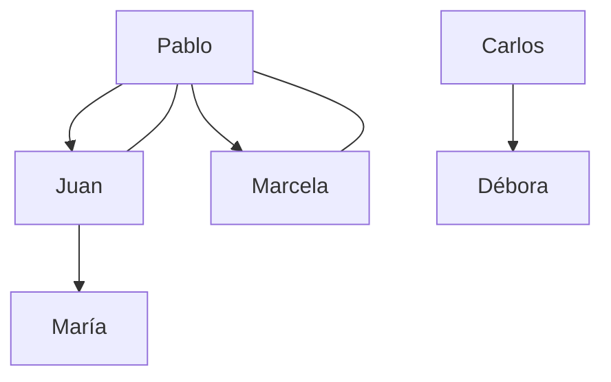

### Lección de Introducción a Prolog: Árbol Genealógico Simple

#### Objetivo:
En esta lección, vamos a introducir los conceptos básicos de **Prolog**, un lenguaje de programación basado en la lógica. Usaremos como ejemplo un **árbol genealógico simple** para modelar relaciones familiares como padre, hijo, hermano, abuelo y pariente. Al final de la lección, podrás realizar consultas simples a este sistema para obtener respuestas basadas en la base de hechos y reglas que definimos.

#### ¿Qué es Prolog?

Prolog es un lenguaje de programación **declarativo** basado en la **lógica de predicados**. En lugar de describir paso a paso cómo se deben realizar las operaciones, Prolog permite definir **hechos** y **reglas**, y luego realizar consultas lógicas sobre ellos.

### Conceptos Clave:

1. **Hechos**: Describen relaciones conocidas. Ejemplo: "`Juan es padre de María`" se representa como `padrede('Juan', 'María')`.
2. **Reglas**: Permiten definir nuevas relaciones basadas en los hechos. Ejemplo: "`A es hijo de B si B es padre de A`" se expresa en Prolog como `hijode(A, B) :- padrede(B, A)`.
3. **Consultas**: Son preguntas que hacemos a Prolog sobre las relaciones definidas. Ejemplo: "`¿Es Juan hermano de Marcela?`" se formula como `?- hermanode('Juan', 'Marcela')`.

---

### Definición del Árbol Genealógico Simple

A continuación, se presenta una base de datos simple en Prolog con hechos que describen relaciones de padre:

```prolog
%%
%% Declaraciones
%%

% Juan es padre de María
padrede('Juan', 'María'). 

% Pablo es padre de Juan y Marcela
padrede('Pablo', 'Juan').  
padrede('Pablo', 'Marcela').  

% Carlos es padre de Débora
padrede('Carlos', 'Débora').
```

Aquí hemos definido algunas relaciones de **padre** (`padrede/2`), donde el primer argumento es el padre y el segundo es el hijo.

### Definición de Reglas

Las reglas nos permiten definir relaciones más complejas basadas en los hechos que hemos definido. A continuación se muestran algunas reglas clave:

1. **Hijo**: Una persona A es hijo de B si B es padre de A.

```prolog
% A es hijo de B si B es padre de A
hijode(A, B) :- 
    padrede(B, A).
```

2. **Abuelo**: Una persona A es abuelo de B si A es padre de C y C es padre de B.

```prolog
% A es abuelo de B si A es padre de C y C es padre de B
abuelode(A, B) :- 
    padrede(A, C), 
    padrede(C, B).
```

3. **Hermano**: Dos personas A y B son hermanos si tienen el mismo padre y no son la misma persona.

```prolog
% A y B son hermanos si el padre de A es el mismo que el de B y A no es B
hermanode(A, B) :- 
    padrede(C, A), 
    padrede(C, B), 
    A \== B.
```

4. **Familiar**: Dos personas A y B son familiares si A es padre, hijo o hermano de B.

```prolog
% A y B son familiares si A es padre de B, hijo de B, o hermano de B
familiarde(A, B) :- 
    padrede(A, B).
familiarde(A, B) :- 
    hijode(A, B).
familiarde(A, B) :- 
    hermanode(A, B).
```

---

### Ejemplos de Consultas

Una vez que hemos definido nuestros hechos y reglas, podemos realizar **consultas** para obtener información sobre las relaciones familiares. A continuación, algunos ejemplos:

1. **¿Juan es hermano de Marcela?**
   ```prolog
   ?- hermanode('Juan', 'Marcela').
   ```
   Resultado: `yes`. Esto es verdadero porque Pablo es el padre de ambos.

2. **¿Carlos es hermano de Juan?**
   ```prolog
   ?- hermanode('Carlos', 'Juan').
   ```
   Resultado: `no`. Carlos y Juan no comparten el mismo padre.

3. **¿Pablo es abuelo de María?**
   ```prolog
   ?- abuelode('Pablo', 'María').
   ```
   Resultado: `yes`. Pablo es abuelo de María porque Pablo es padre de Juan, y Juan es padre de María.

4. **¿María es abuela de Pablo?**
   ```prolog
   ?- abuelode('María', 'Pablo').
   ```
   Resultado: `no`. María no es abuela de Pablo, ya que la relación es en sentido contrario.

---

### Actividad Adicional

Para poner en práctica lo aprendido, deberás modificar este programa para representar la **relación familiar** de **tu propia familia** en lugar de los personajes que hemos utilizado aquí. Sigue estos pasos:

1. **Edita el programa Prolog** para que refleje los hechos reales de tu árbol genealógico (padres, hermanos, abuelos, etc.).
   
   - Asegúrate de reemplazar los hechos (`padrede/2`) por los nombres de tus familiares.
   - Si es necesario, agrega nuevas relaciones como `tío`, `primo`, etc., usando reglas similares a las ya vistas.

2. **Sube tu código a un Gist** en GitHub. El código debe estar bien documentado y contener un encabezado que explique su propósito y las relaciones familiares que estás modelando.

3. **Realiza una grabación de una consulta ASCIINEMA** en la cual apareces como descendiente de algún familiar en el árbol. 

   - En esta grabación, utiliza consultas de la forma `?- abuelode(Abuelo, Yo).` o similares, mostrando cómo llegas a los resultados correctos.
   - **Sube el ASCIINEMA** de la consulta a una plataforma como **AWS** (Amazon Web Services) o cualquier plataforma de alojamiento y comparte el enlace en el Gist.

---

Aquí tienes el diagrama en formato **Mermaid** para los datos del árbol genealógico que describimos anteriormente. El diagrama representa las relaciones de **padre** y **hermano** entre los individuos:



```bash
graph TD;
    %% Definición de las relaciones de padre
    Pablo --> Juan;
    Pablo --> Marcela;
    Juan --> María;
    Carlos --> Débora;
    
    %% Definición de las relaciones de hermanos
    Pablo --- Juan;
    Pablo --- Marcela;
```
Este diagrama está organizado de la siguiente forma:

1. Las **flechas** (`-->`) representan la relación de **padre a hijo**.
2. Las **líneas** (`---`) representan la relación de **hermano** entre los individuos, como es el caso de Juan y Marcela.

### Instrucciones para usar el diagrama:
1. Copia el código Mermaid en cualquier visor o herramienta que soporte **Mermaid.js** (como [Mermaid Live Editor](https://mermaid-js.github.io/mermaid-live-editor/)) para ver el diagrama visualmente.
2. Si lo deseas, puedes modificar este código para agregar más relaciones familiares o incluir otros individuos.

Este diagrama te ayudará a visualizar mejor las conexiones familiares que hemos definido en el programa Prolog.

----

### Rúbrica de Evaluación

- **60%**: Grabación **ASCIINEMA** en la que realices una consulta donde apareces como descendiente dentro de tu árbol genealógico. Debes demostrar la consulta ejecutándose correctamente en tu entorno.
  
- **40%**: **Encabezado y comentarios** del código en el Gist. El programa debe estar bien estructurado, con explicaciones claras de los hechos y reglas que utilizaste para modelar tu familia.

