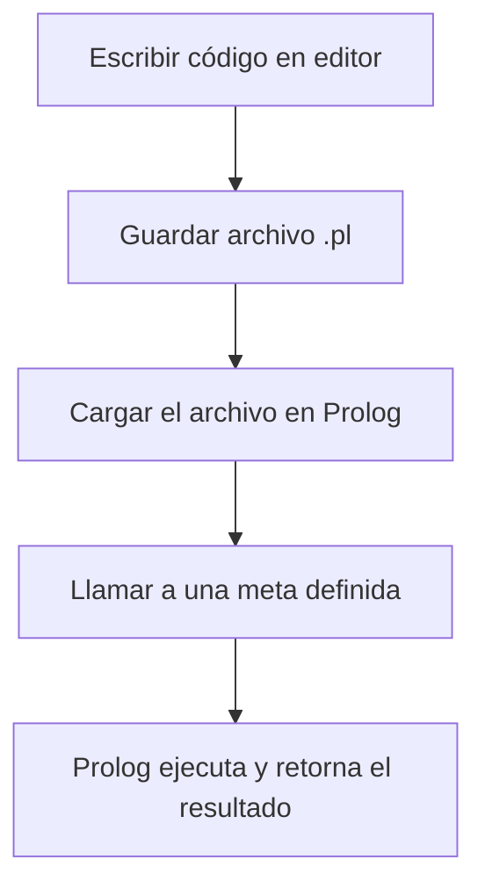

El desarrollo y ejecución de programas en **Prolog** implica varios pasos que son comunes en la mayoría de los lenguajes de programación lógica. A continuación, te explicamos el flujo general para ejecutar un programa en Prolog, prestando especial atención a la implementación con **SWI-Prolog**, una de las versiones más utilizadas y robustas.

### 1. Pasos para ejecutar un programa en Prolog

El proceso básico para ejecutar un programa en **Prolog** incluye:

1. **Crear un archivo** que contenga el programa.
2. **Guardar** el archivo con la extensión adecuada (`.pl` para Prolog).
3. **Cargar** el archivo en el entorno de Prolog (en Prolog esto se llama *compilar*, *consultar* o *reconsultar*).
4. Finalmente, **llamar a una meta** o *goal* definida en el programa.

El siguiente diagrama ilustra este proceso:



### 2. Instalación y configuración de SWI-Prolog en un entorno profesional

Para tus prácticas, usaremos **SWI-Prolog**, que es compatible con múltiples plataformas. Puedes instalarlo en **Ubuntu** (para aquellos que trabajen en AWS o sistemas basados en Linux) o acceder a versiones para **Windows**.

#### Instalación en Ubuntu:
Si estás trabajando en un entorno **Ubuntu**, como el proporcionado en AWS Academy, puedes instalar SWI-Prolog fácilmente, recordatorio del la sesión anterior:

```bash
sudo apt update
sudo apt install swi-prolog
```

#### Instalación en Windows:
En el entorno de la red universitaria, puedes seguir los siguientes pasos para configurar **SWI-Prolog** en **Windows**:

1. Inicia sesión en tu cuenta universitaria.
2. Usa el menú **Inicio** para abrir **Explorador de Windows**.
3. Navega hasta la ubicación: `Mi PC > Teaching > Applications > Departments > Language > Prolog 5 > files > bin`.
4. Encuentra el archivo `plwin.exe`, haz clic derecho y selecciona **Crear acceso directo**. Coloca el acceso directo en tu escritorio para facilitar el acceso.
5. Al hacer doble clic en el ícono del escritorio, se abrirá la consola de SWI-Prolog, donde verás el prompt de Prolog: `|?-`, lo que indica que está listo para recibir tus consultas.

### 3. Crear y editar un programa en Prolog

Para crear un programa en Prolog, necesitas un editor de texto. Si no tienes preferencias, te sugerimos usar **Emacs**, que está integrado con SWI-Prolog y ofrece funcionalidades útiles como el resaltado de sintaxis y formato automático.

#### Crear tu primer programa en Prolog:

1. Abre **SWI-Prolog**.
2. Usa la opción de **Archivo > Nuevo** en la ventana de Emacs para crear un archivo nuevo y nómbralo con la extensión `.pl`.
3. Escribe el código de tu programa en la ventana de archivo. Por ejemplo, un simple programa que saluda:

    ```prolog
    saludo :- write('¡Hola, Prolog!'), nl.
    ```

4. Guarda el archivo utilizando **Archivo > Guardar**.
5. Para ejecutar el programa, vuelve a SWI-Prolog y carga el archivo:

    ```prolog
    ?- consult('ruta/a/tu/archivo.pl').
    ```

6. Una vez cargado, puedes ejecutar la meta definida en tu programa:

    ```prolog
    ?- saludo.
    ```

### 4. Buenas prácticas para estudiantes de Prolog

A continuación, te dejamos algunas recomendaciones para mejorar tu flujo de trabajo en Prolog, basadas en las mejores prácticas profesionales:

- **Documenta tu código**: Aunque Prolog es un lenguaje declarativo, siempre es útil agregar comentarios que expliquen el propósito de cada predicado. Utiliza `%` para comentar líneas individuales.
  
- **Organización de archivos**: Mantén tus archivos `.pl` organizados en directorios bien estructurados. Evita colocar múltiples programas en un solo archivo grande.
  
- **Prueba tus predicados**: A medida que avances en Prolog, usa pruebas simples para validar tus predicados. Puedes definir conjuntos de pruebas con ejemplos y casos límite para asegurarte de que tu lógica sea sólida.
  
- **Explora las bibliotecas de SWI-Prolog**: SWI-Prolog incluye muchas bibliotecas útiles para manipulación de listas, cadenas, estructuras de datos, entre otros. Familiarízate con estas bibliotecas para aprovecharlas al máximo en tus proyectos.

### 5. Próximos pasos

Al finalizar estas primeras prácticas, estarás listo para abordar problemas más complejos en programación lógica. Recuerda que Prolog es un paradigma muy diferente a lenguajes como Erlang, por lo que es importante que te enfoques en pensar en términos de **reglas lógicas** y **relaciones**, más que en el control explícito del flujo del programa.

---


### Explicación del template:
1. **Encabezado profesional**: Incluye información del autor y la fecha.
2. **Código en C# (comentado)**: Proporciona una referencia comentada en C# sobre cómo resolver el mismo problema de encontrar el último elemento de una lista.
3. **Código en Prolog**: El código Prolog que efectivamente resuelve el problema utilizando recursión.

Este formato es útil para estudiantes que estén familiarizándose con la lógica de Prolog y deseen ver un paralelismo con un lenguaje como C#.

```prolog
% ===============================================
% Autor: Juan Pérez
% Fecha: 13 de octubre de 2024
% Descripción: Programa en Prolog que determina 
%              el último elemento de una lista.
%              Se incluye una versión comentada
%              en C# para referencia.
% ===============================================

% -------- Código en C# (comentado) ------------
% using System;
% using System.Collections.Generic;
% 
% class Program
% {
%     // Función para encontrar el último elemento de una lista en C#.
%     static T MyLast<T>(List<T> list)
%     {
%         if (list == null || list.Count == 0)
%             throw new ArgumentException("La lista no puede estar vacía.");
%         
%         return list[list.Count - 1]; // Devuelve el último elemento.
%     }
% 
%     static void Main()
%     {
%         List<char> lista = new List<char> { 'a', 'b', 'c', 'd' };
%         char ultimoElemento = MyLast(lista);
% 
%         Console.WriteLine("El último elemento es: " + ultimoElemento);
%     }
% }
% ----------------------------------------------

% -------- Código en Prolog --------------------
% Predicado my_last(X, List) que determina el último
% elemento X de la lista List.

% Caso base: el último elemento es cuando la lista tiene solo un elemento.
my_last(X, [X]).

% Caso recursivo: ignora el primer elemento de la lista y sigue evaluando.
my_last(X, [_|Tail]) :-
    my_last(X, Tail).

% Ejemplo de uso:
% ?- my_last(X, [a, b, c, d]).
% X = d.
% ----------------------------------------------
```


