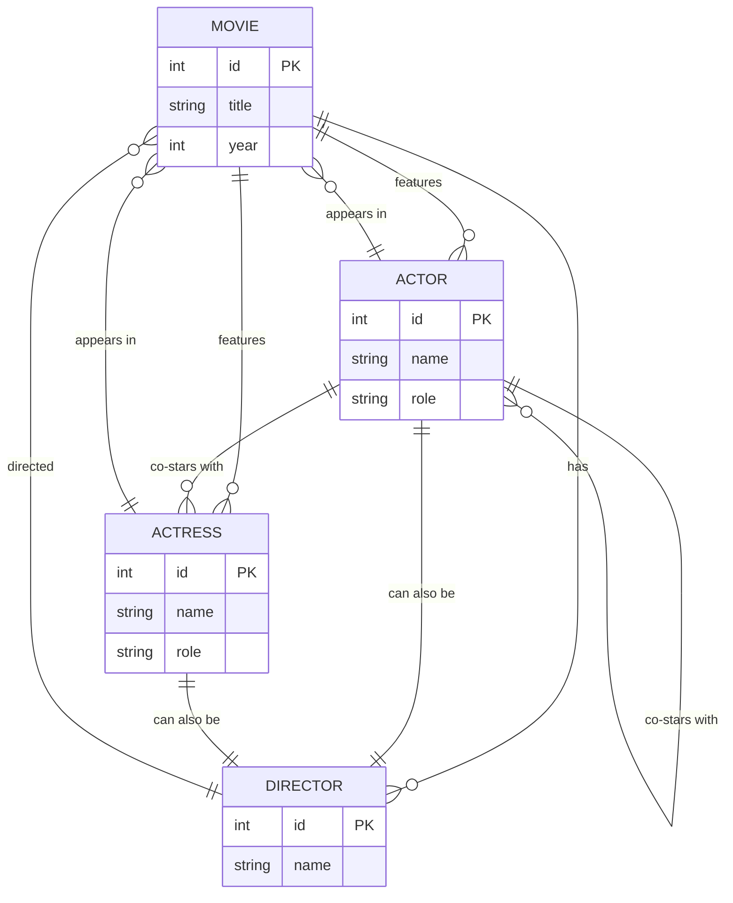

# REPRESENTACION DIAGRAMA Entidad-Relación (SQL)

Para crear una representación de la base de datos Prolog en términos de un modelo entidad-relación (ER) usando el formato de Mermaid, podemos visualizar las relaciones entre las películas, directores, actores y actrices. Este modelo incluye las entidades y sus atributos, así como las relaciones entre ellas.

Aquí te proporciono el código Mermaid para generar un diagrama ER que modela la base de datos del código Prolog convertido a una estructura de base de datos SQL:



### Explicación del modelo:

1. **Entidades**:
   - `MOVIE`: Representa las películas. Cada película tiene un título y un año de lanzamiento.
   - `DIRECTOR`: Representa los directores, que están asociados a una o más películas.
   - `ACTOR`: Representa a los actores que tienen un nombre y el rol que interpretaron en una película.
   - `ACTRESS`: Similar a `ACTOR`, pero para las actrices.

2. **Relaciones**:
   - Una película (`MOVIE`) es dirigida por un director (`DIRECTOR`).
   - Una película puede tener múltiples actores (`ACTOR`) y actrices (`ACTRESS`).
   - Los actores y actrices pueden aparecer en varias películas y también pueden co-protagonizar películas con otros actores o actrices.

3. **Reglas adicionales**:
   - Los actores o actrices también pueden ser directores, representado por la relación bidireccional entre las entidades `ACTOR`, `ACTRESS` y `DIRECTOR`.
   - Los actores pueden aparecer como co-estrellas en una película, reflejado en la relación de `co-star` entre `ACTOR` y `ACTRESS`, y entre `ACTOR` y `ACTOR`.

Este diagrama refleja cómo se podrían organizar los datos si estuviéramos construyendo una base de datos relacional a partir del código Prolog original.

---
A continuación te proporciono un archivo SQL con la estructura de tablas correspondiente al modelo entidad-relación que mencionamos antes, junto con la inserción de datos para 25 películas, incluyendo los directores, actores y actrices. Esta estructura se basa en la lógica de la base de datos Prolog adaptada para SQL.

### **Archivo SQL**

```sql
-- Crear la tabla de películas
CREATE TABLE MOVIE (
    id INT PRIMARY KEY,
    title VARCHAR(255),
    year INT
);

-- Crear la tabla de directores
CREATE TABLE DIRECTOR (
    id INT PRIMARY KEY,
    name VARCHAR(255)
);

-- Crear la tabla de actores
CREATE TABLE ACTOR (
    id INT PRIMARY KEY,
    name VARCHAR(255),
    role VARCHAR(255),
    movie_id INT,
    FOREIGN KEY (movie_id) REFERENCES MOVIE(id)
);

-- Crear la tabla de actrices
CREATE TABLE ACTRESS (
    id INT PRIMARY KEY,
    name VARCHAR(255),
    role VARCHAR(255),
    movie_id INT,
    FOREIGN KEY (movie_id) REFERENCES MOVIE(id)
);

-- Crear la tabla que relaciona películas con directores
CREATE TABLE MOVIE_DIRECTOR (
    movie_id INT,
    director_id INT,
    PRIMARY KEY (movie_id, director_id),
    FOREIGN KEY (movie_id) REFERENCES MOVIE(id),
    FOREIGN KEY (director_id) REFERENCES DIRECTOR(id)
);

-- Insertar 25 películas en la tabla MOVIE
INSERT INTO MOVIE (id, title, year) VALUES
(1, 'American Beauty', 1999),
(2, 'The Matrix', 1999),
(3, 'Inception', 2010),
(4, 'The Godfather', 1972),
(5, 'Pulp Fiction', 1994),
(6, 'The Dark Knight', 2008),
(7, 'Fight Club', 1999),
(8, 'Forrest Gump', 1994),
(9, 'The Shawshank Redemption', 1994),
(10, 'Schindler''s List', 1993),
(11, 'Titanic', 1997),
(12, 'Gladiator', 2000),
(13, 'Avatar', 2009),
(14, 'Interstellar', 2014),
(15, 'The Silence of the Lambs', 1991),
(16, 'Saving Private Ryan', 1998),
(17, 'The Social Network', 2010),
(18, 'The Avengers', 2012),
(19, 'Jurassic Park', 1993),
(20, 'Star Wars: A New Hope', 1977),
(21, 'The Lord of the Rings: The Fellowship of the Ring', 2001),
(22, 'The Wolf of Wall Street', 2013),
(23, 'Deadpool', 2016),
(24, 'Spider-Man: Into the Spider-Verse', 2018),
(25, 'La La Land', 2016);

-- Insertar directores en la tabla DIRECTOR
INSERT INTO DIRECTOR (id, name) VALUES
(1, 'Sam Mendes'),
(2, 'Lana Wachowski'),
(3, 'Christopher Nolan'),
(4, 'Francis Ford Coppola'),
(5, 'Quentin Tarantino'),
(6, 'Christopher Nolan'),
(7, 'David Fincher'),
(8, 'Robert Zemeckis'),
(9, 'Frank Darabont'),
(10, 'Steven Spielberg'),
(11, 'James Cameron'),
(12, 'Ridley Scott'),
(13, 'James Cameron'),
(14, 'Christopher Nolan'),
(15, 'Jonathan Demme'),
(16, 'Steven Spielberg'),
(17, 'David Fincher'),
(18, 'Joss Whedon'),
(19, 'Steven Spielberg'),
(20, 'George Lucas'),
(21, 'Peter Jackson'),
(22, 'Martin Scorsese'),
(23, 'Tim Miller'),
(24, 'Bob Persichetti'),
(25, 'Damien Chazelle');

-- Relacionar las películas con los directores
INSERT INTO MOVIE_DIRECTOR (movie_id, director_id) VALUES
(1, 1),
(2, 2),
(3, 3),
(4, 4),
(5, 5),
(6, 6),
(7, 7),
(8, 8),
(9, 9),
(10, 10),
(11, 11),
(12, 12),
(13, 13),
(14, 14),
(15, 15),
(16, 16),
(17, 17),
(18, 18),
(19, 19),
(20, 20),
(21, 21),
(22, 22),
(23, 23),
(24, 24),
(25, 25);

-- Insertar actores en la tabla ACTOR
INSERT INTO ACTOR (id, name, role, movie_id) VALUES
(1, 'Kevin Spacey', 'Lester Burnham', 1),
(2, 'Keanu Reeves', 'Neo', 2),
(3, 'Leonardo DiCaprio', 'Cobb', 3),
(4, 'Marlon Brando', 'Don Vito Corleone', 4),
(5, 'John Travolta', 'Vincent Vega', 5),
(6, 'Christian Bale', 'Bruce Wayne', 6),
(7, 'Brad Pitt', 'Tyler Durden', 7),
(8, 'Tom Hanks', 'Forrest Gump', 8),
(9, 'Morgan Freeman', 'Ellis Boyd Redding', 9),
(10, 'Liam Neeson', 'Oskar Schindler', 10),
(11, 'Leonardo DiCaprio', 'Jack Dawson', 11),
(12, 'Russell Crowe', 'Maximus', 12),
(13, 'Sam Worthington', 'Jake Sully', 13),
(14, 'Matthew McConaughey', 'Cooper', 14),
(15, 'Anthony Hopkins', 'Hannibal Lecter', 15),
(16, 'Tom Hanks', 'Captain Miller', 16),
(17, 'Jesse Eisenberg', 'Mark Zuckerberg', 17),
(18, 'Robert Downey Jr.', 'Tony Stark', 18),
(19, 'Sam Neill', 'Dr. Alan Grant', 19),
(20, 'Mark Hamill', 'Luke Skywalker', 20),
(21, 'Elijah Wood', 'Frodo Baggins', 21),
(22, 'Leonardo DiCaprio', 'Jordan Belfort', 22),
(23, 'Ryan Reynolds', 'Wade Wilson', 23),
(24, 'Shameik Moore', 'Miles Morales', 24),
(25, 'Ryan Gosling', 'Sebastian', 25);

-- Insertar actrices en la tabla ACTRESS
INSERT INTO ACTRESS (id, name, role, movie_id) VALUES
(1, 'Annette Bening', 'Carolyn Burnham', 1),
(2, 'Carrie-Anne Moss', 'Trinity', 2),
(3, 'Ellen Page', 'Ariadne', 3),
(4, 'Diane Keaton', 'Kay Adams', 4),
(5, 'Uma Thurman', 'Mia Wallace', 5),
(6, 'Maggie Gyllenhaal', 'Rachel Dawes', 6),
(7, 'Helena Bonham Carter', 'Marla Singer', 7),
(8, 'Robin Wright', 'Jenny Curran', 8),
(9, 'Rita Hayworth', 'Movie Actress', 9),
(10, 'Ben Kingsley', 'Itzhak Stern', 10),
(11, 'Kate Winslet', 'Rose DeWitt Bukater', 11),
(12, 'Connie Nielsen', 'Lucilla', 12),
(13, 'Zoe Saldana', 'Neytiri', 13),
(14, 'Anne Hathaway', 'Brand', 14),
(15, 'Jodie Foster', 'Clarice Starling', 15),
(16, 'Matt Damon', 'Private Ryan', 16),
(17, 'Rooney Mara', 'Erica Albright', 17),
(18, 'Scarlett Johansson', 'Natasha Romanoff', 18),
(19, 'Laura Dern', 'Dr. Ellie Sattler', 19),
(20, 'Carrie Fisher', 'Leia Organa', 20),
(21, 'Liv Tyler', 'Arwen', 21),
(22, 'Margot Robbie', 'Naomi Lapaglia', 22),
(23, 'Morena Baccarin', 'Vanessa', 23),
(24, 'Hailee Steinfeld', 'Gwen Stacy', 24),
(25, 'Emma Stone', 'Mia', 25);
```

### Explicación del archivo SQL:

1. **Tablas**:
   - `MOVIE`: Almacena las películas con su `id`, `title` y `year`.
   - `DIRECTOR`: Almacena los directores con su `id` y `name`.
   - `ACTOR` y `ACTRESS`: Almacenan los actores y actrices respectivamente, con su `id`, `name`, `role` (el personaje que interpretan), y el `movie_id` que referencia a la película en la que participan.
   - `MOVIE_DIRECTOR`: Tabla intermedia que relaciona películas con sus directores (ya

 que una película tiene un solo director en esta estructura).

2. **Datos Insertados**:
   - Se han agregado 25 películas famosas con su respectivo director.
   - Se han insertado actores y actrices principales de cada película.
   
Puedes ejecutar este archivo SQL en una base de datos compatible como MySQL o PostgreSQL para crear las tablas y poblarlas con estos datos.
