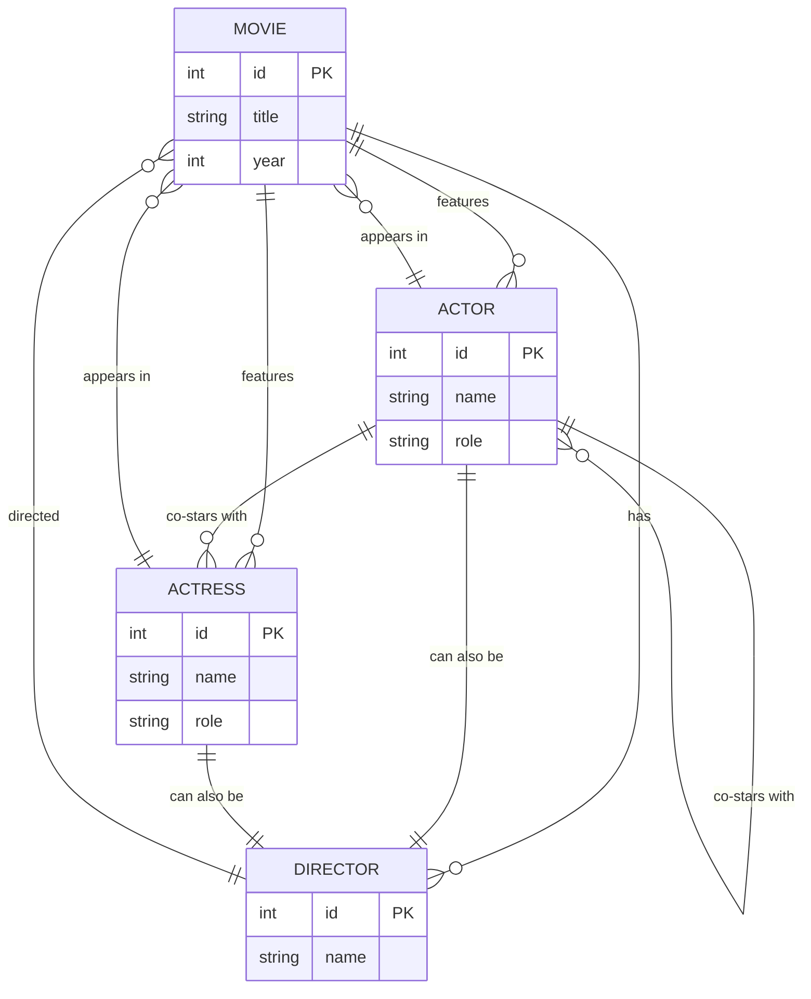

Para crear una representación de la base de datos Prolog en términos de un modelo entidad-relación (ER) usando el formato de Mermaid, podemos visualizar las relaciones entre las películas, directores, actores y actrices. Este modelo incluye las entidades y sus atributos, así como las relaciones entre ellas.

Aquí te proporciono el código Mermaid para generar un diagrama ER que modela la base de datos del código Prolog convertido a una estructura de base de datos SQL:

### Explicación del modelo:

1. **Entidades**:
   - `MOVIE`: Representa las películas. Cada película tiene un título y un año de lanzamiento.
   - `DIRECTOR`: Representa los directores, que están asociados a una o más películas.
   - `ACTOR`: Representa a los actores que tienen un nombre y el rol que interpretaron en una película.
   - `ACTRESS`: Similar a `ACTOR`, pero para las actrices.

2. **Relaciones**:
   - Una película (`MOVIE`) es dirigida por un director (`DIRECTOR`).
   - Una película puede tener múltiples actores (`ACTOR`) y actrices (`ACTRESS`).
   - Los actores y actrices pueden aparecer en varias películas y también pueden co-protagonizar películas con otros actores o actrices.

3. **Reglas adicionales**:
   - Los actores o actrices también pueden ser directores, representado por la relación bidireccional entre las entidades `ACTOR`, `ACTRESS` y `DIRECTOR`.
   - Los actores pueden aparecer como co-estrellas en una película, reflejado en la relación de `co-star` entre `ACTOR` y `ACTRESS`, y entre `ACTOR` y `ACTOR`.

Este diagrama refleja cómo se podrían organizar los datos si estuviéramos construyendo una base de datos relacional a partir del código Prolog original.
