# CASOS NO PRACTICOS
## de Diagrama Entidad-Reacion de Base de datos a Prolog

Para modelar el esquema de la tienda de celulares en Prolog, es necesario representar las entidades y sus relaciones como hechos y reglas. Cada entidad (clientes, celulares, ventas, reparaciones, técnicos) se modela con predicados que describen sus atributos. Las relaciones entre las entidades se pueden modelar mediante predicados adicionales.

A continuación se muestra el código Prolog basado en el diagrama ER proporcionado:

```prolog
% Definición de clientes: cliente(ClienteID, Nombre, Apellido, Email, Telefono, Direccion).
cliente(1, 'Juan', 'Pérez', 'juan.perez@mail.com', '555-1234', 'Calle Falsa 123').
cliente(2, 'Ana', 'Gómez', 'ana.gomez@mail.com', '555-5678', 'Av. Siempreviva 742').
cliente(3, 'Carlos', 'Ramírez', 'carlos.ramirez@mail.com', '555-8765', 'Calle Larga 456').
cliente(4, 'Lucía', 'Mendoza', 'lucia.mendoza@mail.com', '555-4321', 'Plaza Mayor 12').
cliente(5, 'Pedro', 'López', 'pedro.lopez@mail.com', '555-1111', 'Callejón del Gato 7').
cliente(6, 'María', 'Martínez', 'maria.martinez@mail.com', '555-2222', 'Av. de la Paz 15').
cliente(7, 'Roberto', 'Sánchez', 'roberto.sanchez@mail.com', '555-3333', 'Calle de los Álamos 99').
cliente(8, 'Sofía', 'Hernández', 'sofia.hernandez@mail.com', '555-4444', 'Calle Luna 22').
cliente(9, 'Andrés', 'Vega', 'andres.vega@mail.com', '555-5555', 'Calle Sol 8').
cliente(10, 'Elena', 'Ríos', 'elena.rios@mail.com', '555-6666', 'Boulevard Verde 19').

% Definición de celulares: celular(ModeloID, Marca, Modelo, PrecioVenta, StockDisponible).
celular(1, 'Apple', 'iPhone 13', 999.99, 10).
celular(2, 'Samsung', 'Galaxy S21', 799.99, 15).
celular(3, 'Xiaomi', 'Mi 11', 699.99, 8).
celular(4, 'Google', 'Pixel 6', 899.99, 5).
celular(5, 'OnePlus', '9 Pro', 749.99, 7).
celular(6, 'Sony', 'Xperia 5 III', 849.99, 3).
celular(7, 'Huawei', 'P40', 699.99, 12).
celular(8, 'Motorola', 'Edge 20', 649.99, 9).
celular(9, 'Nokia', 'G50', 499.99, 20).
celular(10, 'LG', 'Wing', 999.99, 6).

% Definición de ventas: venta(VentaID, FechaVenta, Cantidad, Total, ClienteID, ModeloID).
venta(1, '2023-10-01', 1, 999.99, 1, 1).
venta(2, '2023-10-05', 2, 1599.98, 2, 2).
venta(3, '2023-10-10', 1, 699.99, 3, 3).
venta(4, '2023-10-12', 1, 899.99, 4, 4).
venta(5, '2023-10-13', 3, 2249.97, 5, 5).
venta(6, '2023-10-15', 1, 849.99, 6, 6).
venta(7, '2023-10-16', 2, 1399.98, 7, 7).
venta(8, '2023-10-17', 1, 649.99, 8, 8).
venta(9, '2023-10-18', 1, 499.99, 9, 9).
venta(10, '2023-10-19', 1, 999.99, 10, 10).

% Definición de reparaciones: reparacion(ReparacionID, FechaReparacion, DescripcionProblema, CostoReparacion, ClienteID, ModeloID).
reparacion(1, '2023-09-15', 'Pantalla rota', 199.99, 1, 1).
reparacion(2, '2023-10-07', 'Batería defectuosa', 99.99, 2, 2).
reparacion(3, '2023-09-20', 'Problema de software', 149.99, 3, 3).
reparacion(4, '2023-09-25', 'Altavoz dañado', 79.99, 4, 4).
reparacion(5, '2023-09-28', 'Cámara no funciona', 129.99, 5, 5).
reparacion(6, '2023-10-01', 'Conector de carga roto', 89.99, 6, 6).
reparacion(7, '2023-10-03', 'Pantalla rota', 199.99, 7, 7).
reparacion(8, '2023-10-06', 'Batería inflada', 99.99, 8, 8).
reparacion(9, '2023-10-08', 'Problema de encendido', 109.99, 9, 9).
reparacion(10, '2023-10-10', 'Sensores dañados', 179.99, 10, 10).

% Definición de técnicos: tecnico(TecnicoID, Nombre, Especialidad, Telefono).
tecnico(1, 'Carlos', 'Pantallas', '555-9876').
tecnico(2, 'Laura', 'Baterías', '555-5432').
tecnico(3, 'Miguel', 'Software', '555-6543').
tecnico(4, 'Sofía', 'Cámaras', '555-7654').
tecnico(5, 'Jorge', 'Conectores', '555-8765').
tecnico(6, 'Ana', 'Altavoces', '555-3210').
tecnico(7, 'Luis', 'Sensores', '555-4321').
tecnico(8, 'María', 'Problemas eléctricos', '555-5432').
tecnico(9, 'Pedro', 'Microchips', '555-6543').
tecnico(10, 'Silvia', 'Pantallas', '555-7654').

% Relación de reparaciones y técnicos: reparacion_tecnico(ReparacionID, TecnicoID).
reparacion_tecnico(1, 1).
reparacion_tecnico(2, 2).
reparacion_tecnico(3, 3).
reparacion_tecnico(4, 6).
reparacion_tecnico(5, 4).
reparacion_tecnico(6, 5).
reparacion_tecnico(7, 1).
reparacion_tecnico(8, 2).
reparacion_tecnico(9, 7).
reparacion_tecnico(10, 7).

% Reglas para consultar datos.

% Regla para obtener las ventas realizadas por un cliente
ventas_cliente(ClienteID, VentaID, FechaVenta, Cantidad, Total, ModeloID) :-
    venta(VentaID, FechaVenta, Cantidad, Total, ClienteID, ModeloID).

% Regla para obtener las reparaciones solicitadas por un cliente
reparaciones_cliente(ClienteID, ReparacionID, FechaReparacion, DescripcionProblema, CostoReparacion, ModeloID) :-
    reparacion(ReparacionID, FechaReparacion, DescripcionProblema, CostoReparacion, ClienteID, ModeloID).

% Regla para obtener las reparaciones asignadas a un técnico
reparaciones_tecnico(TecnicoID, ReparacionID, FechaReparacion, DescripcionProblema, CostoReparacion, ClienteID, ModeloID) :-
    reparacion_tecnico(ReparacionID, TecnicoID),
    reparacion(ReparacionID, FechaReparacion, DescripcionProblema, CostoReparacion, ClienteID, ModeloID).

```

### Explicación:

1. **Clientes**: Se define un predicado `cliente/6` para representar a los clientes y sus atributos.
2. **Celulares**: Se define un predicado `celular/5` para representar los modelos de celulares disponibles.
3. **Ventas**: Se define el predicado `venta/6` para representar las ventas, asociando clientes con celulares.
4. **Reparaciones**: El predicado `reparacion/6` representa las reparaciones realizadas, asociando clientes con celulares.
5. **Técnicos**: El predicado `tecnico/4` representa a los técnicos disponibles.
6. **Reparaciones_Tecnicos**: El predicado `reparacion_tecnico/2` establece la relación entre reparaciones y técnicos asignados.
   
### Consultas:

- **Ventas de un cliente**: Puedes consultar las ventas de un cliente usando `ventas_cliente/6`.
  ```prolog
  ?- ventas_cliente(1, VentaID, Fecha, Cantidad, Total, ModeloID).
  ```

- **Reparaciones de un cliente**: Puedes consultar las reparaciones solicitadas por un cliente usando `reparaciones_cliente/6`.
  ```prolog
  ?- reparaciones_cliente(1, ReparacionID, Fecha, Descripcion, Costo, ModeloID).
  ```

- **Reparaciones asignadas a un técnico**: Para saber qué reparaciones tiene asignado un técnico, usa `reparaciones_tecnico/7`.
  ```prolog
  ?- reparaciones_tecnico(1, ReparacionID, Fecha, Descripcion, Costo, ClienteID, ModeloID).
  ```

Este código puede extenderse para cubrir más funcionalidades, como agregar, eliminar o modificar datos de las entidades, como lo conocemos el CRUD en base de datos.

---
# GRAFOS 

```mermaid
graph TD;
    %% Definición de relaciones principales del sistema en Prolog

    %% Clientes y celulares conectados a través de ventas y reparaciones
    subgraph Clientes
        C1["Juan Pérez"]
        C2["Ana Gómez"]
        C3["Carlos Ramírez"]
        C4["Lucía Mendoza"]
        C5["Pedro López"]
        C6["María Martínez"]
        C7["Roberto Sánchez"]
        C8["Sofía Hernández"]
        C9["Andrés Vega"]
        C10["Elena Ríos"]
    end

    subgraph Celulares
        M1["iPhone 13"]
        M2["Galaxy S21"]
        M3["Xiaomi Mi 11"]
        M4["Google Pixel 6"]
        M5["OnePlus 9 Pro"]
        M6["Sony Xperia 5 III"]
        M7["Huawei P40"]
        M8["Motorola Edge 20"]
        M9["Nokia G50"]
        M10["LG Wing"]
    end

    subgraph Ventas
        V1["Venta 1"]
        V2["Venta 2"]
        V3["Venta 3"]
        V4["Venta 4"]
        V5["Venta 5"]
        V6["Venta 6"]
        V7["Venta 7"]
        V8["Venta 8"]
        V9["Venta 9"]
        V10["Venta 10"]
    end

    subgraph Reparaciones
        R1["Reparación 1"]
        R2["Reparación 2"]
        R3["Reparación 3"]
        R4["Reparación 4"]
        R5["Reparación 5"]
        R6["Reparación 6"]
        R7["Reparación 7"]
        R8["Reparación 8"]
        R9["Reparación 9"]
        R10["Reparación 10"]
    end

    subgraph Técnicos
        T1["Carlos - Pantallas"]
        T2["Laura - Baterías"]
        T3["Miguel - Software"]
        T4["Sofía - Cámaras"]
        T5["Jorge - Conectores"]
        T6["Ana - Altavoces"]
        T7["Luis - Sensores"]
        T8["María - Problemas eléctricos"]
        T9["Pedro - Microchips"]
        T10["Silvia - Pantallas"]
    end

    %% Relaciones de Ventas
    C1 --> V1
    V1 --> M1
    C2 --> V2
    V2 --> M2
    C3 --> V3
    V3 --> M3
    C4 --> V4
    V4 --> M4
    C5 --> V5
    V5 --> M5
    C6 --> V6
    V6 --> M6
    C7 --> V7
    V7 --> M7
    C8 --> V8
    V8 --> M8
    C9 --> V9
    V9 --> M9
    C10 --> V10
    V10 --> M10

    %% Relaciones de Reparaciones y Técnicos
    C1 --> R1
    R1 --> M1
    R1 --> T1

    C2 --> R2
    R2 --> M2
    R2 --> T2

    C3 --> R3
    R3 --> M3
    R3 --> T3

    C4 --> R4
    R4 --> M4
    R4 --> T6

    C5 --> R5
    R5 --> M5
    R5 --> T4

    C6 --> R6
    R6 --> M6
    R6 --> T5

    C7 --> R7
    R7 --> M7
    R7 --> T1

    C8 --> R8
    R8 --> M8
    R8 --> T2

    C9 --> R9
    R9 --> M9
    R9 --> T7

    C10 --> R10
    R10 --> M10
    R10 --> T7
```



<a href="sql-CRUD.md">
    
</a>


