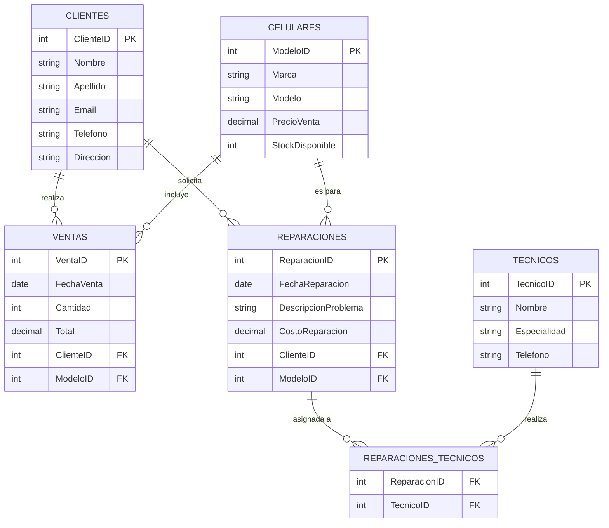

Este es un diagrama muy funcional para modelar una tienda de celulares que maneja tanto ventas como reparaciones.

### Explicación:
- **Clientes** tiene una relación uno-a-muchos con **Ventas** (un cliente puede realizar múltiples ventas).
- **Celulares** tiene una relación uno-a-muchos con **Ventas** (un celular puede estar en múltiples ventas).
- **Clientes** tiene una relación uno-a-muchos con **Reparaciones** (un cliente puede solicitar múltiples reparaciones).
- **Celulares** tiene una relación uno-a-muchos con **Reparaciones** (un celular puede estar en múltiples reparaciones).
- **Reparaciones** tiene una relación muchos-a-muchos con **Técnicos**, y esta relación se modela a través de la tabla intermedia **Reparaciones_Tecnicos**.

